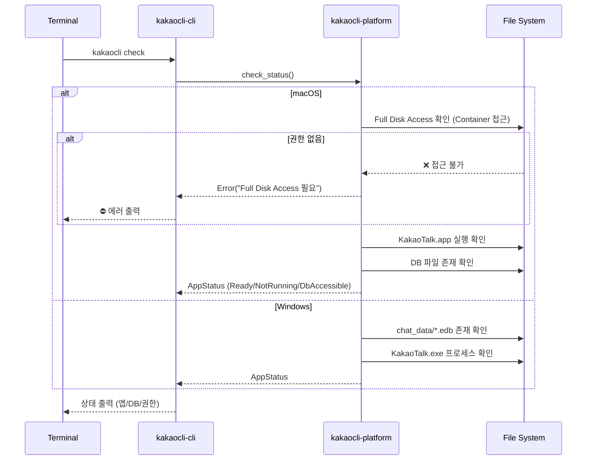
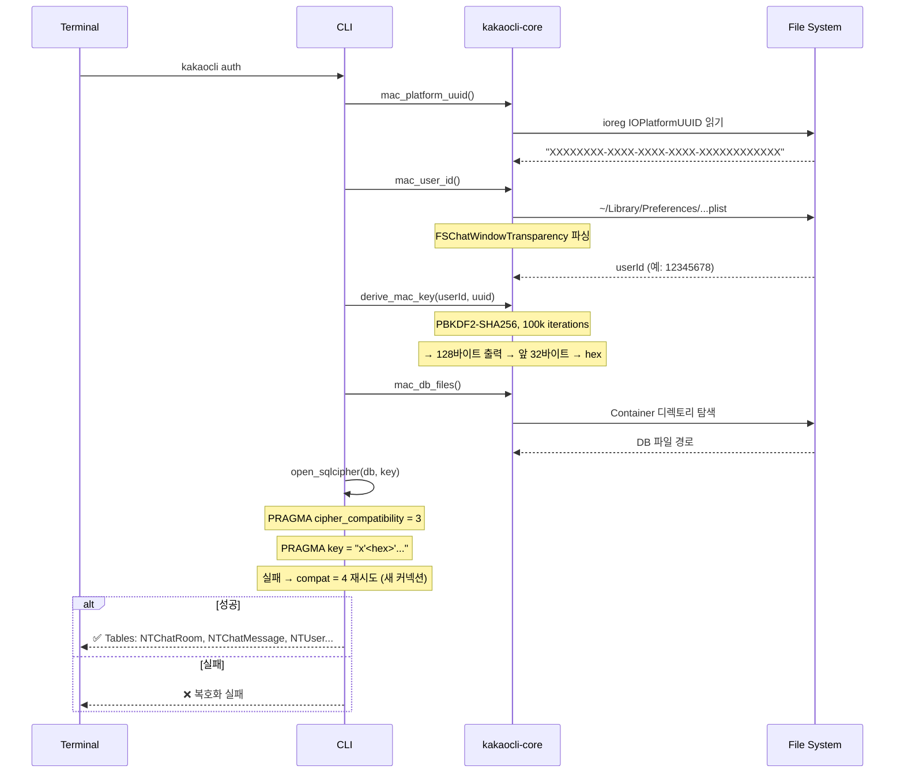
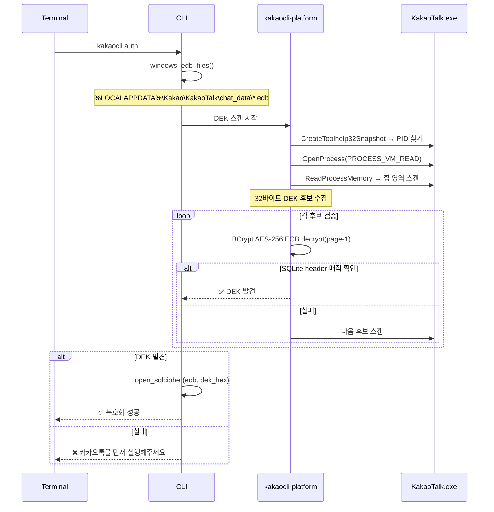
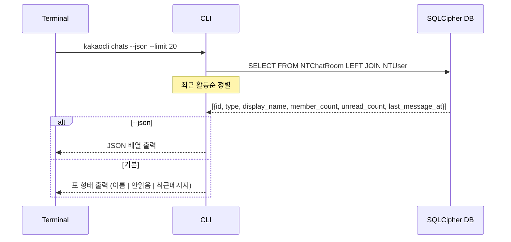
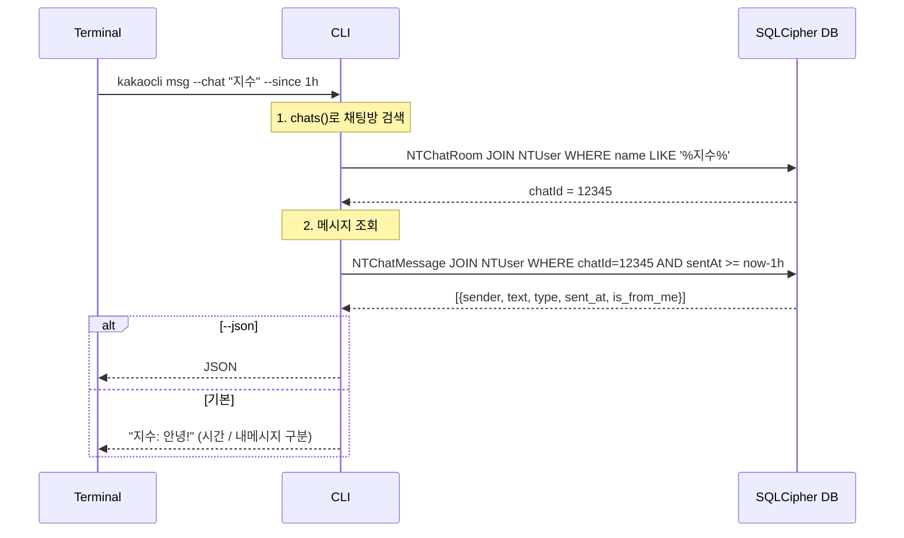
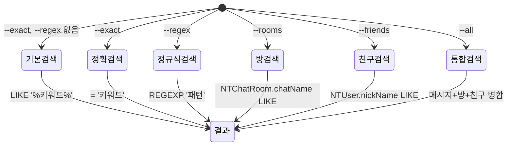
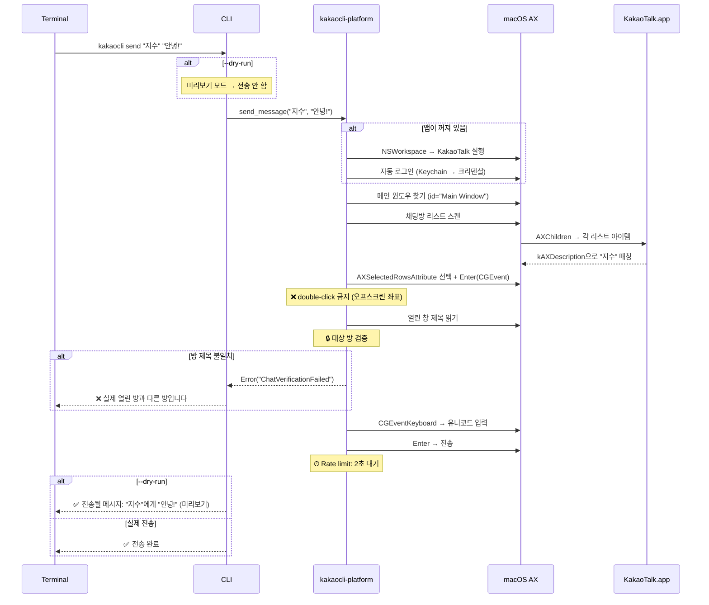
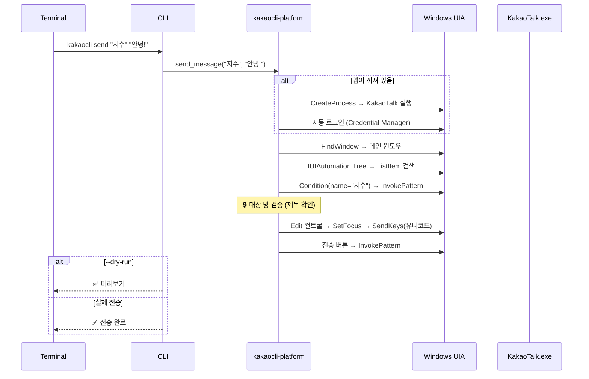
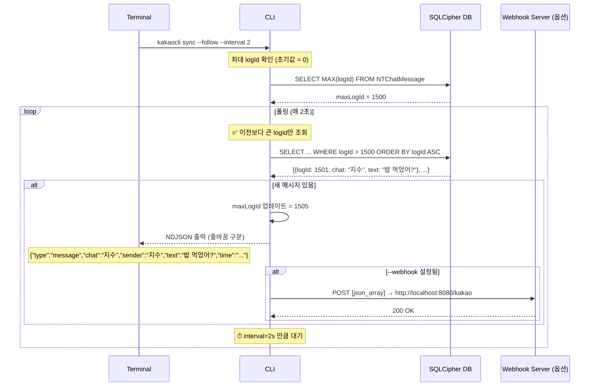

# 기능별 흐름도

---

## 1. 상태 확인 (`kakaocli check`)



---

## 2. DB 복호화 (`kakaocli auth`)

### macOS 흐름



### Windows 흐름



---

## 3. 채팅방 목록 (`kakaocli chats`)



---

## 4. 메시지 조회 (`kakaocli msg`)



---

## 5. 검색 (`kakaocli find`)



---

## 6. 메시지 전송 (`kakaocli send`) — macOS



---

## 7. 메시지 전송 (`kakaocli send`) — Windows



---

## 8. 🔄 새 메시지 동기화 흐름 (`kakaocli sync --follow`)

**이게 너가 말한 "채팅 동기화" 흐름이야.**



### 동기화 관련 기술적 포인트

| 항목 | 설명 |
|------|------|
| **트리거 방식** | ❌ 푸시 불가 (DB만 있음). **폴링** 사용 |
| **증분 조회** | `WHERE logId > :last_max` — 이미 읽은 메시지는 다시 안 가져옴 |
| **출력 형식** | NDJSON (JSON Stream) — `sync \| jq` 조합 가능 |
| **--webhook** | 새 메시지를 HTTP POST로 전달 → 내 서버에서 처리 |
| **macOS** | 앱 없이 DB만으로 동기화 가능 ✅ |
| **Windows** | KakaoTalk.exe 실행 중이어야 DEK 있음 (DB 접근) ⚠️ |
| **DEK 캐싱** | Windows는 한 번 검증된 DEK를 로컬 캐시에 저장 → 재시작 없으면 지속 사용 |
| **Rate limit** | --interval 기본 2초. 너무 빠르면 DB 부하 |

---

## 9. 전체 기능 요약 맵

```mermaid
flowchart TB
    CLI[kakaocli-rs CLI]
    
    CLI --> CHECK[check]
    CLI --> AUTH[auth]
    CLI --> CHATS[chats]
    CLI --> MSG[msg]
    CLI --> FIND[find]
    CLI --> QUERY[query]
    CLI --> SEND[send]
    CLI --> SYNC[sync]
    CLI --> INSPECT[inspect]
    CLI --> LOGIN[login]

    AUTH -->|macOS| KDF[PBKDF2 키 유도]
    AUTH -->|Windows| DEK[프로세스 메모리 DEK 스캔]
    KDF --> DB[(SQLCipher DB)]
    DEK --> DB

    CHATS --> DB
    MSG --> DB
    FIND --> DB
    QUERY --> DB
    
    SEND -->|macOS| AX[AXUIElement 자동화]
    SEND -->|Windows| UIA[UIAutomation 자동화]
    
    SYNC --> DB
    SYNC -->|--webhook| WEB[HTTP POST]
    SYNC -->|stdout| NDJSON[NDJSON 스트림]

    INSPECT -->|macOS| AX
    INSPECT -->|Windows| UIA

    LOGIN --> KEY[keyring → OS 키체인]